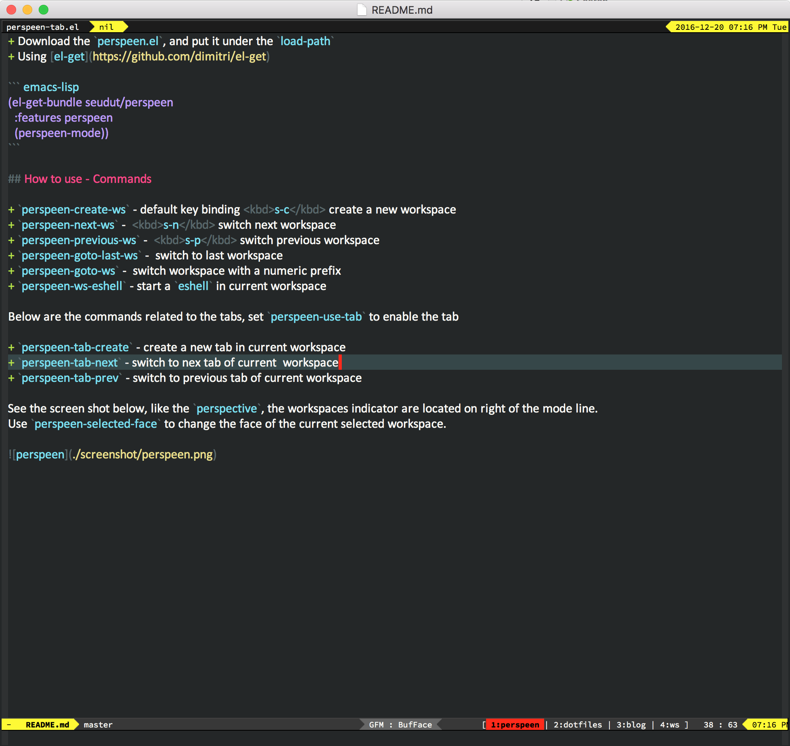

## Perspeen
This is a package for GNU Emacs in order to make it much more  convenient to work with multiple workspaces simultaneously.

## The History
Before using Emacs, I am a vimer and my coding work flow is `iTerms` + `Zsh` + `Tmux` + `Vim`.  I often open multiple tmux windows. Each window
is an workspace,  splitted with at least two panes; one pane runs `macvim`, and another pane below runs `zsh`. Each window has its own workspace.
The work flow is very convenient and efficient for me. There is a video presentation for this if your'r interested [iterm zsh tmux vim](https://www.youtube.com/watch?v=cCgJaOwCNaI)

When switch to Emacs, since I perfer the GUI Emacs, I have always been looking for a package which can replace these.

## Why named perspeen
This package is inspired from [perspective](https://github.com/nex3/perspective-el) and [elscreen](https://github.com/knu/elscreen). `perspective` is 
good, but it has not tab-persist.  This package, `perspeen`, is intended to combine both `perspective` and `elscreen`. Make the workspace has the tab-persist feature.
So the name is also combined from these two package names. `persp-een`.

## Install and config
+ Download the `perspeen.el`, and put it under the `load-path`
+ Using [el-get](https://github.com/dimitri/el-get)

``` emacs-lisp
(el-get-bundle seudut/perspeen
  :features perspeen
  (perspeen-mode))
```

## How to use - Commands

+ `perspeen-create-ws` - default key binding <kbd>s-c</kbd> create a new workspace 
+ `perspeen-next-ws` -  <kbd>s-n</kbd> switch next workspace
+ `perspeen-previous-ws` -  <kbd>s-p</kbd> switch previous workspace
+ `perspeen-goto-last-ws` -  switch to last workspace
+ `perspeen-goto-ws` -  switch workspace with a numeric prefix
+ `perspeen-ws-eshell` - start a `eshell` in current workspace

See the screen shot below, like the `perspective`, the workspaces indicator are located on right of the mode line.
Use `perspeen-selected-face` to change the face of the current selected workspace.


